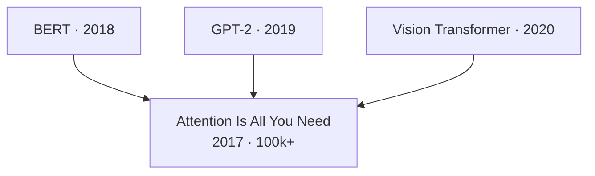

# Paper Navigator

Find and read academic papers in four stages:

```
┌──────────────┐    ┌──────────┐    ┌──────────┐    ┌──────────┐
│ Disambiguate │ →  │ Discover │ →  │ Evaluate │ →  │   Read   │
└──────────────┘    └──────────┘    └──────────┘    └──────────┘
                                                         ↓
                                              ┌──────────────────┐
                                              │ research-survey  │ (for survey reports)
                                              │ research-ideation│ (for idea generation)
                                              └──────────────────┘
```

**Setup:** Scripts are in `skills/paper-navigator/scripts/`. Run via `python skills/paper-navigator/scripts/<name>.py`. Optional env vars for higher rate limits: `S2_API_KEY` (Semantic Scholar), `JINA_API_KEY` (Jina Reader), `GITHUB_TOKEN`, `HF_TOKEN`.

## When to Use

- User needs papers for quantum algorithms, baselines, datasets, application scenarios, or cloud showcase constraints.
- User asks for related work, SOTA comparisons, citations, code availability, or method evidence before selecting a cqlib route.
- User needs a paper-grounded basis for `research-survey`, `research-ideation`, or `paper-planning`.

## When NOT to Use

- **Writing a survey report** -> use `research-survey` after collecting papers.
- **Generating or ranking quantum application ideas** -> use `research-ideation`.
- **Planning delivery artifacts or success signals** -> use `paper-planning`.
- **Writing README, INTEGRATE, verification reports, or slides** -> use `paper-writing` or `academic-slides`.

### Semantic Scholar Key Gate (MANDATORY)

Before using any Semantic Scholar-dependent script, check whether `S2_API_KEY` is set.

- If `S2_API_KEY` **is set**: you may use `scholar_search`, `citation_traverse`, `recommend`, `author_search`, `trending`, and other S2-backed tools normally.
- If `S2_API_KEY` is **missing**: do **not** use Semantic Scholar. Tell the user that Semantic Scholar is unavailable without a key and ask whether they want to provide one. If they do not provide a key, continue with **non-S2 sources only**: `arxiv_monitor`, web search, GitHub search, Hugging Face search, or direct paper URLs/DOIs/arXiv IDs.
- Without `S2_API_KEY`, skip citation-graph expansion (`citation_traverse`, `recommend`) entirely instead of retrying or waiting.

---

## Step 0: Search Strategy Principles (MANDATORY)

Every discovery task MUST follow these principles before executing any workflow.

### Query Reformulation

Before searching, decompose the user's topic and generate **4-6 variant queries** covering distinct research angles. This is critical because different papers use different terminology for the same concept, and a single research topic often spans multiple sub-communities.

**Step 1: Sub-topic decomposition.** Identify 3-5 distinct research angles within the user's query. Most research topics span multiple perspectives:
- **Empirical vs. theoretical** — papers that observe/measure the phenomenon vs. papers that prove/explain it formally
- **Mechanism vs. condition** — papers about *how* something works vs. *when/why* it emerges
- **Method keywords** — different communities use different terms for the same concept (e.g., "gradient descent" vs. "meta-optimization" vs. "implicit learning")
- **Adjacent formulations** — the same idea framed differently (e.g., "in-context learning" vs. "few-shot learning" vs. "learning from demonstrations")

**Step 2: Generate queries.** Create at least one query per identified angle, using synonym substitution, specificity adjustment, and structural variants:
- **Synonym substitution**: "data pruning" → "data selection", "data filtering", "data curation"
- **Specificity adjustment**: broaden ("pretraining data quality") or narrow ("perplexity-based data pruning LLM")
- **Structural variants**: swap word order, add/remove qualifiers, use abbreviations

Example: User asks "how LLMs gain in-context learning during pretraining"
- Angles: (a) mechanistic/circuit, (b) training dynamics, (c) ICL-as-optimization theory, (d) data/task conditions, (e) formal theory
- Query 1: `"in-context learning emergence pretraining language model"` (general)
- Query 2: `"induction heads formation training transformer"` (mechanistic)
- Query 3: `"transformers learn in-context gradient descent meta-learning"` (optimization view)
- Query 4: `"pretraining task diversity data structure in-context learning"` (data conditions)
- Query 5: `"in-context learning theory linear attention generalization"` (formal theory)

Example: User asks "papers about data pruning for LLM pretraining"
- Angles: (a) selection methods, (b) quality metrics, (c) scaling effects
- Query 1: `"data pruning pretraining language model"`
- Query 2: `"data selection pretraining LLM"`
- Query 3: `"training data curation large language model quality"`
- Query 4: `"data quality scoring pretraining scaling"`

### Multi-Source Parallel Search

**Never rely on a single search source.** For every discovery task, run at least 2 sources:
- **Primary (with `S2_API_KEY`)**: `scholar_search` (S2 with automatic arXiv fallback on rate limit)
- **Primary (without `S2_API_KEY`)**: `arxiv_monitor --keywords "<variants>" --match-mode flexible`
- **Secondary**: web search or GitHub search for recent blog posts, surveys, repos, and paper links
- **Tertiary**: additional non-S2 sources such as direct arXiv/DOI URLs or Hugging Face dataset/model search when relevant

**CRITICAL — S2 usage rule:**
- **With `S2_API_KEY` set**: You MAY use S2-backed scripts. Prefer moderate fan-out and keep citation expansion scoped to the user's actual need.
- **Without `S2_API_KEY`**: Do **not** invoke S2-backed scripts at all. Do not “try once anyway”, do not queue retries, and do not run `citation_traverse` / `recommend`.
- **How to check:** Before starting discovery, run `echo $S2_API_KEY` or check if the env var is set. If empty, tell the user Semantic Scholar is unavailable without a key and continue with non-S2 sources.
- **arXiv-only scripts** (`arxiv_monitor`) are NOT affected by this rule and can always run in parallel with other non-S2 calls.

### Rate-Limit-Aware Fallback Chain

When Semantic Scholar returns 429 or empty results:
1. `scholar_search` automatically falls back to arXiv (built-in since v1.2)
2. Use `arxiv_monitor --keywords` with `--match-mode flexible` for broader coverage
3. Switch to web search for blog posts, surveys, GitHub repos that reference papers
4. Space S2-dependent calls (`citation_traverse`, `recommend`) at least 5s apart and reduce `--limit`

**Prevention is better than fallback:** The arXiv fallback produces lower-quality results (no citation counts, less precise relevance ranking). If `S2_API_KEY` is missing, skip S2 entirely and use the non-S2 chain from the start.

### Mandatory Citation Expansion (for multi-paper discovery tasks)

After finding **≥3 relevant seed papers**, you **MUST** expand coverage using the citation graph **only when `S2_API_KEY` is available**. The goal is to discover papers that keyword search cannot reach.

**Seed selection:** Rank all found relevant papers by citation count. Pick the top 3 as primary seeds.

**Expansion steps (all mandatory):**
1. **Co-citation** on the single highest-cited seed: `citation_traverse --direction co-citation --limit 15` — this is the strongest signal for finding closely related work that uses different terminology
2. **Forward citations** on the top 2 seeds: `citation_traverse --direction forward --limit 20` — finds follow-up work
3. **Backward citations** on 1-2 seeds whose topic coverage differs: `citation_traverse --direction backward --limit 20` — finds foundational and adjacent work that seeds build on. Pick seeds from different sub-topics to maximize coverage breadth
4. **Recommendations** with diverse seeds: `recommend --positive <seed1>,<seed2>,<seed3>` — serendipitous discovery of semantically related work not connected by citations

**Seed diversity principle:** When selecting seeds for backward traversal or recommendations, prefer seeds from *different sub-topics* identified in query reformulation. This prevents the citation graph from staying within a single research community.

**Applies to**: WF1 (Survey), WF3 (Quick Search with >10 results), WF5 (Track Developments), WF9 (Ideation), WF10 (User-specified count), and only when `S2_API_KEY` is configured.
**Does NOT apply to**: WF2 (Find specific paper), WF7 (Read paper by URL).

### Coverage Gap Check (for multi-paper discovery tasks)

After initial search + citation expansion, review the collected papers against the sub-topics identified during query reformulation.

**For each sub-topic angle:**
1. Count how many collected papers address it
2. If a sub-topic has **0-1 papers**, run a targeted `scholar_search` with a query specific to that angle **only when `S2_API_KEY` is available**. Otherwise use `arxiv_monitor`, web search, or GitHub search for that angle.
3. If targeted search finds new relevant papers and `S2_API_KEY` is available, optionally run one more `citation_traverse` or `recommend` round on the new finds

This step catches systematic blind spots where an entire research perspective was missed by all prior queries. It is lightweight — typically 1-2 additional searches for gaps, not a full re-search.

**Applies to**: Same workflows as Mandatory Citation Expansion.

---

## Step 1: Classify Intent and Select Workflow

**Start here.** Determine what the user wants and route to the right workflow. Match complexity to intent — simple queries get simple answers.

| Intent | Signal | Workflow | Complexity |
|--------|--------|----------|------------|
| **Find a specific paper** | Title, author name, or URL | [WF 2](#workflow-2-navigational-search) | Single search call |
| **Quick paper search** | "give me papers about X", "find papers on X" | [WF 3](#workflow-3-quick-paper-search) | Single search call |
| **Metadata search** | Author + year, venue filter | [WF 4](#workflow-4-metadata-search) | Single search + filter |
| **Track recent advances** | "latest", "recent", "what's new" | [WF 5](#workflow-5-track-field-developments) | 1-2 calls |
| **Find a baseline** | Code, SOTA, implementation | [WF 6](#workflow-6-find-a-baseline-with-code) | Search + code check |
| **Read a paper** | URL or "read this paper" | [WF 7](#workflow-7-read-a-paper-by-url) | Fetch + read |
| **Ambiguous term** | Project name, module name, nickname | [WF 8](#workflow-8-ambiguous-query-resolution) | Web search + resolve |
| **Literature survey** | "survey X", comprehensive coverage | [WF 1](#workflow-1-collect-papers-for-survey) → then hand off to `research-survey` | Iterative collection |
| **Related work map** | Connections between papers | [WF 1](#workflow-1-collect-papers-for-survey) | Citation traversal |
| **Ideation support** | Called from research-ideation | [WF 9](#workflow-9-ideation-support) | Iterative + strict filter |
| **User-specified count** | "find me exactly N papers about X" | [WF 10](#workflow-10-user-specified-paper-count) | Adaptive |

**Key principle:** Simple "find me papers about X" queries should return results from a single search call, not trigger the full iterative collection workflow. Only use iterative expansion for comprehensive surveys or ideation support.

---

## Step 2: Resolve Ambiguous Terms (if needed)

When the user's query might be a colloquial name, project name, or module name (rather than a paper title):

1. **Quick academic search** — Try `scholar_search` with the exact query
2. **If zero results** — Broaden the search:
   - **Web search**: Find GitHub repos, blog posts, or social media that reveal the actual paper title or arXiv ID
   - **GitHub search**: `github_search.py --query "USER_QUERY"` — repos often link to papers
3. **Extract identifiers** — Actual paper title, arXiv ID, GitHub repo URL, author names
4. **Re-enter** the appropriate workflow with resolved identifiers

Example disambiguation report:
```
🔍 Disambiguation Report for "deepseek engram"
├── Intent: Track recent advances (ambiguous term)
├── Resolution: "Engram" is a module name from DeepSeek AI
│   ├── Actual paper: "Conditional Memory via Scalable Lookup" (ArXiv:2601.07372)
│   └── GitHub: https://github.com/deepseek-ai/Engram
└── Search Plan:
    ├── scholar_search --query "Conditional Memory Scalable Lookup" --sort-by year
    ├── citation_traverse --paper-id ArXiv:2601.07372 --direction forward
    └── github_search --query "deepseek engram"
```

---

## Standard Output Formats

Use these formats when presenting results to the user. Match the format to the intent.

### Format A: Single Paper Card (for navigational search, WF 2)

```
📄 **Highly accurate protein structure prediction with AlphaFold**
Authors: Jumper et al.
Year: 2021 | Venue: Nature
Citations: 25,000+
DOI: 10.1038/s41586-021-03819-2 | S2 ID: 235959867
Link: https://doi.org/10.1038/s41586-021-03819-2
TLDR: End-to-end neural network for protein structure prediction achieving atomic accuracy...
```

### Format B: Paper List Table (for quick search, metadata search, trending — WF 3/4/5)

```
| # | Title | Authors | Year | Venue | Citations | ID |
|---|-------|---------|------|-------|-----------|-----|
| 1 | Paper Title | First Author et al. | 2024 | NeurIPS | 150 | arXiv:2401.xxxxx |
| 2 | ... | ... | ... | ... | ... | ... |
```

After the table, briefly note how many results were found and whether the list was filtered.

### Format C: Baseline Recommendation (for baseline hunt, WF 6)

```
📦 **Recommended Baseline: [Model Name]**
Paper: [Title] ([Year], [Venue]) — [arXiv ID]
Code: [GitHub URL] ⭐ [stars] | Framework: [PyTorch/TF]
Performance: [key metric = value] on [dataset]
HuggingFace: [model page URL] | Downloads: [N]
```

### Format D: Reading Notes (for read a paper, WF 7)

Use the template at `assets/paper-summary-template.md`. Save to `/artifacts/paper-notes/{paper-id}.md`.

### Format E: Disambiguation Report (for ambiguous queries, WF 8)

```
🔍 Disambiguation Report for "[query]"
├── Intent: [classified intent]
├── Resolution: [what the term actually refers to]
│   ├── Paper: [resolved title] ([arXiv ID])
│   └── Code: [GitHub URL]
└── Search Plan:
    ├── [script call 1]
    └── [script call 2]
```

---

## Common Workflows

### Workflow 1: Collect Papers for Survey

> "Help me survey CRISPR-based gene therapy for sickle cell disease"

**Use iterative collection** (target 30-80 papers). See [Appendix A](#appendix-a-iterative-collection-workflow) for the full iterative methodology.

1. **Discover:** If `S2_API_KEY` is available, start with `scholar_search --query "CRISPR gene therapy sickle cell" --limit 20 --sort-by citations` → iterative expansion with EXPLORE/EXPLOIT strategy → `citation_traverse --direction forward` on seminal papers. If the key is missing, tell the user Semantic Scholar is unavailable without a key, then use `arxiv_monitor` + web/GitHub search instead and skip citation-graph expansion.
2. **Evaluate:** Review each paper's title + abstract for relevance → filter by abstract quality → prefer top-tier venues → shortlist
3. **Read:** `fetch_paper` for key papers → L2 reading → notes using `assets/paper-summary-template.md`
4. **Hand off to `research-survey`** to synthesize the collected papers into a structured survey report

### Workflow 2: Navigational Search

> "Find me the attention is all you need paper"
> "Find me the original GPT 3 paper"

1. **Discover:** If `S2_API_KEY` is available, use `scholar_search --query "Attention Is All You Need"` — single call, return top result. If the key is missing, ask whether the user wants to provide one; otherwise resolve via arXiv/DOI/web search and continue without S2.
2. **Output:** Use **Format A** (Single Paper Card)

**Do NOT** proceed to Read unless the user explicitly asks.

### Workflow 3: Quick Paper Search

> "Give me papers about perovskite solar cell stability under humidity"
> "Find papers on gut microbiome modulation for autoimmune diseases"

1. **Sub-topic decomposition + query reformulation:** Identify 3-5 research angles within the topic, generate 4-6 variant queries covering distinct angles (see Step 0)
2. **Discover:** If `S2_API_KEY` is set, run `scholar_search --query "<variant>" --limit 20 --sort-by relevance` on each variant. If the key is missing, tell the user Semantic Scholar is unavailable without a key, skip `scholar_search`, and use `arxiv_monitor --keywords "<variants>" --match-mode flexible` plus web/GitHub search instead.
3. **Citation expansion (if initial results ≥ 3 relevant papers and `S2_API_KEY` is available):** Follow Mandatory Citation Expansion (Step 0) — co-citation on highest-cited seed, forward on top 2, backward on 1-2 diverse seeds, recommend with 3 seeds
4. **Coverage gap check:** Review collected papers against identified sub-topics. Run targeted searches for uncovered angles using S2 only when the key is available; otherwise use non-S2 sources
5. **Filter:** Review all results, deduplicate, keep relevant papers based on title + abstract
6. **Output:** Use **Format B** (Paper List Table)

Only escalate to full iterative workflow (WF1) if results are clearly insufficient or the user explicitly asks for more.

### Workflow 4: Metadata Search

> "2012 papers by David Harel"
> "Papers by David Harel from 2020 to 2022"
> "Journal articles by David Harel from 2020 to 2022"

1. **Parse query:** Extract author name, year range, venue type (journal/conference)
2. **Discover:** `author_search --name "David Harel" --papers --limit 50 --sort-by year`
3. **Filter:** Year range, venue type (check `venue` field), other attributes
4. **Output:** Use **Format B** (Paper List Table)

For keyword + year filter (no author): `scholar_search --query "<keywords>" --year-min YYYY --year-max YYYY`

### Workflow 5: Track Field Developments

> "What's new in condensed matter physics this week?"

1. **Discover:** `arxiv_monitor --categories cond-mat --days 7` (see `references/arxiv-categories.md` for codes) + `trending --query "topological insulator" --period 30`
2. **Output:** Use **Format B** (Paper List Table), highlight high-potential papers with TLDRs

### Workflow 6: Find a Baseline with Code

> "I need a baseline for protein structure prediction with code"

1. **Discover:** `scholar_search --query "protein structure prediction" --sort-by citations`
2. **Evaluate:** `find_code` on top results + `sota --task "protein-structure-prediction"` → pick one with official code + high downloads
3. **Output:** Use **Format C** (Baseline Recommendation)

### Workflow 7: Read a Paper by URL

> "Read this paper: arxiv.org/abs/2301.12345"

**Output:** Use **Format D** (Reading Notes)

1. **Fetch:** `fetch_paper --url "https://arxiv.org/abs/2301.12345"`
2. **Choose reading depth** (see `references/reading-strategy.md`):

| Level | Goal | When to use | Effort |
|-------|------|-------------|--------|
| **L1 Technical** | Can reimplement | Building directly on this paper | High |
| **L2 Analytical** | Understand motivation + design choices | Most papers in a survey | Medium |
| **L3 Contextual** | Know what it is and where it fits | Quick scanning | Low |

3. **Take notes** using `assets/paper-summary-template.md`. Save to `/artifacts/paper-notes/{paper-id}.md`.

### Workflow 8: Ambiguous Query Resolution

> "Find the latest about deepseek engram"

1. **Disambiguate:** Follow [Step 2](#step-2-resolve-ambiguous-terms-if-needed) above
2. **Discover:** `scholar_search` with resolved title + `github_search` with original term + `citation_traverse` on arXiv ID
3. **Evaluate:** Review results, check code via `find_code` or GitHub
4. **Read:** `fetch_paper` for top papers
5. **If user wants a survey:** hand off to `research-survey`

### Workflow 9: Ideation Support (called from research-ideation)

> research-ideation Step 2 needs papers to build a literature tree

**Iterative collection with strict filter** (target 30-50 papers, recent 2020+). See [Appendix A](#appendix-a-iterative-collection-workflow) and [Appendix B](#appendix-b-ideation-vs-survey-collection).

1. **Disambiguate:** Parse the research goal → extract domain + method type
2. **Discover:** Initial broad search (60 candidates) → iterative expansion up to 15 rounds:
   - EXPLORE: new keyword queries for diverse sub-areas
   - EXPLOIT: `citation_traverse` or `recommend` on strongly relevant papers
3. **Evaluate:** Only keep strongly relevant papers. Prefer top-tier venues + 2020+ papers.
4. **Deduplicate:** Track seen titles and abstracts.
5. **Output:** 30-50 high-quality papers → feed into novelty tree + challenge-insight tree.

### Workflow 10: User-Specified Paper Count

> "Find me exactly 15 papers about reinforcement learning from human feedback"

1. Use the user's number as the target
2. Apply the closest profile's quality settings
3. Run iterative collection until target met or max iterations exhausted
4. If not enough, progressively relax relevance standard and inform the user

---

## Discovery Paths (Stage 1 Detail)

Seven paths, used by workflows above.

### Path A: Keyword Search (most common)

```bash
python scripts/scholar_search.py --query "transformer attention mechanism" --limit 20 --sort-by citations
```

Options: `--year-min/--year-max`, `--open-access-only`, `--sort-by relevance|citations|year`.

### Path B: Citation Traversal

```bash
# Forward — who cited this paper
python scripts/citation_traverse.py --paper-id ArXiv:1706.03762 --direction forward --limit 20

# Backward — what this paper cites
python scripts/citation_traverse.py --paper-id ArXiv:1706.03762 --direction backward --limit 20

# Co-citation — papers frequently cited alongside this one (most powerful for finding related work)
python scripts/citation_traverse.py --paper-id ArXiv:1706.03762 --direction co-citation --limit 15
```

### Path C: Recommendations

```bash
python scripts/recommend.py --positive ArXiv:1706.03762,ArXiv:2005.14165 --limit 15
python scripts/recommend.py --positive ArXiv:1706.03762 --negative ArXiv:2301.00001 --limit 10
```

### Path D: Author Tracking

```bash
python scripts/author_search.py --name "Geoffrey Hinton" --papers --limit 20 --sort-by citations
```

### Path E: arXiv Monitoring

```bash
python scripts/arxiv_monitor.py --categories cs.CL,cs.AI --days 3 --limit 30
python scripts/arxiv_monitor.py --keywords "chain of thought,reasoning" --days 7
python scripts/arxiv_monitor.py --keywords "data pruning pretraining" --match-mode flexible --days 365
```

Options: `--match-mode flexible` (default, AND-of-words for better recall) or `--match-mode exact` (phrase matching for precision). See `references/arxiv-categories.md` for category codes.

### Path F: Trending Detection

```bash
python scripts/trending.py --query "large language models" --period 90 --limit 15
```

Ranks by citation velocity (citations/month).

### Path G: GitHub Search

```bash
python scripts/github_search.py --query "deepseek engram" --limit 10
python scripts/github_search.py --query "mamba state space model" --sort stars
```

Useful when papers haven't been published on arXiv yet or industry labs release code before papers.

### Citation Graph Visualization

After traversal, visualize with Mermaid (keep ≤30 nodes):



---

## Evaluation Tools (Stage 2 Detail)

### Quick Assessment (from scholar_search output)

| Signal | What it tells you |
|--------|-------------------|
| TLDR | One-sentence understanding |
| Citation count | Overall impact |
| Influential citations | Quality of impact |
| Year + venue | Recency and authority |
| Open Access PDF | Whether you can read full text |

### Code Availability

```bash
python scripts/find_code.py --arxiv-id 1706.03762
```

### Top Models by Task

```bash
python scripts/sota.py --task "text-generation" --limit 10
python scripts/sota.py --task "translation" --list-tasks
```

### Dataset Discovery

```bash
python scripts/dataset_search.py --query "sentiment analysis" --limit 10
```

### Reproducibility Assessment

| Dimension | Check |
|-----------|-------|
| Code | Open-source? Official? Stars? Last update? |
| Results | Reproduced on SOTA leaderboard? |
| Data | Dataset publicly available? |
| **Overall** | High / Medium / Low / None |

---

## After Collecting Papers: Next Steps

| Goal | Hand off to |
|------|------------|
| Generate a literature survey report | `research-survey` — synthesizes papers into a structured 8-section report |
| Generate research ideas | `research-ideation` — builds novelty tree + challenge-insight tree from papers |
| Write a Related Work section | `paper-writing` — uses paper notes as input |

### Quick Report (optional, stays in paper-navigator)

For a brief summary table without a full survey report, use `literature_report.py`:

```bash
python scripts/literature_report.py --paper-ids ArXiv:2601.07372,ArXiv:2501.12948 --intent quick_scan
```

| Intent | Output |
|--------|--------|
| `quick_scan` | Brief table: title, authors, year, citations, TLDR |
| `baseline_hunt` | Code availability, SOTA position, dataset access, reproducibility |

For full survey reports (`survey`, `deep_dive` intents), use `research-survey` instead.

---

## Appendix A: Iterative Collection Workflow

For workflows requiring many papers (survey, ideation support), use iterative expand-and-filter:

```
1. Parse query → extract goal, search terms, key term definitions
2. Define task attributes → identify domain + method type
3. Initial search → scholar_search with broad query
4. Review each paper's title + abstract → judge relevance (keep/reject)
5. LOOP until target met or max iterations reached:
   a. From kept papers, pick the most relevant as "grounding set"
   b. Generate next search query:
      - EXPLORE: new keyword query to broaden coverage
      - EXPLOIT: citation_traverse or recommend on a high-relevance paper
   c. Fetch new papers → review → deduplicate → add to collection
6. Final filter: apply quality checks, take top N
```

**Relevance judging**: You (Claude) evaluate each paper directly from title + abstract against the user's goal. No separate API call needed.

**Deduplication**: Track seen titles (normalized) and abstract prefixes. Skip already-evaluated papers.

**Quality filtering**:
1. Skip papers with very short abstracts (< 20 words)
2. For ideation/survey: prefer top-tier venues and journals in the user's field (e.g., Nature, Science, Cell, Lancet, PNAS for broad science; field-specific top venues like NeurIPS/ICML for ML, Physical Review Letters for physics, JACS for chemistry, etc.)
3. For ideation: prefer 2020+ papers; include older only if foundational

## Appendix B: Ideation vs Survey Collection

| Aspect | Ideation Support | Literature Survey |
|--------|-----------------|-------------------|
| **Goal** | Find gaps and transferable techniques | Comprehensive field coverage |
| **Relevance standard** | Strict — only strongly relevant | Moderate — include tangentially relevant |
| **Recency** | Strong bias toward 2020+ | Include foundational older work |
| **Initial search size** | 60 candidates | 20 candidates |
| **Coverage strategy** | Deep on core topic + cross-domain | Balanced across sub-topics |
| **Output use** | Novelty tree + challenge-insight tree | Comprehensive report |

## Appendix C: Script & API Reference

All scripts output Markdown to stdout, errors to stderr. Common flags: `--limit N`, `--json`.

### Paper ID Formats

Scripts accept and normalize automatically: S2 ID, arXiv (`ArXiv:1706.03762` or `1706.03762` or URL), DOI (`DOI:10.18653/v1/N18-3011`).

### Rate Limits

| API | Without key | With key | When rate limited |
|-----|-------------|----------|-------------------|
| Semantic Scholar | **Disabled** — set `S2_API_KEY` to enable | 100 req/min; parallel OK | `scholar_search` auto-falls back to arXiv; `citation_traverse`/`recommend` require the key |
| arXiv | 1 req/3s (courtesy) | N/A | Primary fallback when S2 is limited; no auth needed |
| Jina Reader | Free tier | Higher with key | — |
| HuggingFace | 500 req / 300s | Higher with `HF_TOKEN` | — |
| GitHub | 10 req/min | 5,000 req/hr (set `GITHUB_TOKEN`) | — |

All scripts retry on 429 and 5xx errors with exponential backoff (3s, 6s, 12s, 24s, 48s — 5 retries). A global S2 request pacer enforces minimum interval between Semantic Scholar API calls to prevent budget exhaustion.

For detailed API endpoints, query parameters, and field specifications, see `references/api-reference.md`.

---

## Integration

- **research-survey:** After collecting papers, hand off to research-survey for structured survey report generation (8-section goal-centric synthesis).
- **research-ideation:** After collecting papers, hand off to research-ideation for idea generation (novelty tree + challenge-insight tree + problem selection + solution design).
- **experiment-pipeline:** After finding a baseline via Workflow 6, hand off to experiment-pipeline.
- **paper-writing:** Paper notes serve as input for paper-writing's Related Work section.
